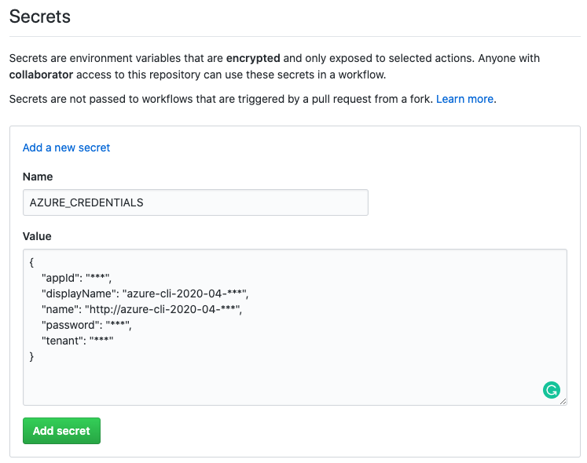

# GitHub Action for Azure Resource Manager (ARM) deployment
This example shows how you can use GitHub Actions to deploy an ARM template to Azure.

## What is an GitHub Action?
**GitHub describes this best itself:**   
GitHub Actions help you automate your software development workflows in the same place you store code and collaborate on pull requests and issues. You can write individual tasks, called actions, and combine them to create a custom workflow. Workflows are custom automated processes that you can set up in your repository to build, test, package, release, or deploy any code project on GitHub.

With GitHub Actions you can build end-to-end continuous integration (CI) and continuous deployment (CD) capabilities directly in your repository.

*Source: https://help.github.com/en/actions/getting-started-with-github-actions/about-github-actions#about-github-actions*

## What is the whiteducksoftware/azure-arm-action Action?
This actions helps us on deploying ARM templates to Azure, so we don't need fiddle around with the Azure CLI in our GitHub workflow. This action is written in **Go**, automatically build to a very small docker image (currently ~7 MB) and deployed to Docker Hub ([whiteduck/azure-arm-action on Docker Hub](https://hub.docker.com/repository/docker/whiteduck/azure-arm-action)). 

We also have previously build a [JavaScript/Node.js version](https://github.com/whiteducksoftware/azure-arm-action-js) of this Action but decided to completely rebuild this Action in Go.   
Reasons for this rebuild among other where the following:
- Go is measurable **faster** than Node.js 
- Running in a Docker container which provides a 
**reliable** and controlable environment
- Go is a **rising language** in the Cloud native and DevOps world and gains more and more in popularity

## How to use this Action?
We start by fetching the credentials this workflow requires for authenticating with Azure, see [Create Service Principal for Authentication](#Create-Service-Principal-for-Authentication). After that we need to define a step so our task has access to the local repo and its files, this can be achieved by using a task which GitHub itself provides us: [actions/checkout](https://github.com/actions/checkout). Our workflow file currently should look like this:
```yaml
- name: Checkout Sourcecode
  uses: actions/checkout@master
```
Now we need to add our [whiteducksoftware/azure-arm-action](https://github.com/whiteducksoftware/azure-arm-action) task to finally deploy our ARM Template:
```yaml
- uses: whiteducksoftware/azure-arm-action@v2.2
  with:
    creds: ${{ secrets.AZURE_CREDENTIALS }}
    resourceGroupName: <YourResourceGroup>
    templateLocation: <path/to/azuredeploy.json>
    deploymentName: github-test
```
*File: [assets/yaml/usage.yaml](assets/yaml/usage.yaml)*   
For more Information on how to configure the parameters see [Required Inputs](#Required-Inputs).

If we combine the the two task and bring them into the required format, the final workflow should look like this:
```yaml
on:
  push:
    branches:
      - master
    paths:
      - "github-action-deploy-arm-template/assets/yaml/workflows/example.yaml"
      - "github-action-deploy-arm-template/assets/json/template.json"
      - "github-action-deploy-arm-template/assets/json/parameters.json"

name: Infrastructure

jobs:
  build-and-deploy:
    runs-on: ubuntu-latest
    steps:
      - name: Checkout Sourcecode
        uses: actions/checkout@master

      - name: Deploy ARM Template
        uses: whiteducksoftware/azure-arm-action@v2.2
        with:
            creds: ${{ secrets.AZURE_CREDENTIALS }}
            resourceGroupName: <YourResourceGroup>
            templateLocation: github-action-deploy-arm-template/assets/json/template.json
            parametersLocation: github-action-deploy-arm-template/assets/json/parameters.json
            deploymentName: github-test
```
*File: [assets/yaml/workflows/example.yaml](assets/yaml/workflows/example.yaml)*

### Required Inputs
* `creds` **Required**   
    [Create Service Principal for Authentication](#Create-Service-Principal-for-Authentication)    

* `resourceGroupName` **Required**   
    Provide the name of a resource group.

* `templateLocation` **Required**  
    Specify the path to the Azure Resource Manager template.  
(See [assets/json/template.json](assets/json/template.json))

* `deploymentName` **Required**  
    Specifies the name of the resource group deployment to create.

* `deploymentMode`   
    Incremental (only add resources to resource group) or Complete (remove extra resources from resource group).  
    Default: `Incremental`.

* `parametersLocation`   
    Specify the path to the Azure Resource Manager parameters file.  
    (See [assets/json/serviceprincipal.json](assets/json/parameters.json))

#### Create service principal for Authentication
In order the action can authenticate to Azure you need to create a new or use an existing service principal. You can easily create an serviceprincipal using the [azure cli](https://docs.microsoft.com/en-us/cli/azure/?view=azure-cli-latest).   
Just run `az ad sp create-for-rbac --sdk-auth` and save the output of the command, navigate then to `Settings -> Secrets` and add the json output as value, as shown below.   
   
[assets/json/serviceprincipal.json](assets/json/serviceprincipal.json)   

If you are using an existing service principal just write the json yourself.

## Where is the source code of this Action?
The source of this action can be found in our white duck Software GitHub Organization.   
Here: https://github.com/whiteducksoftware/azure-arm-action