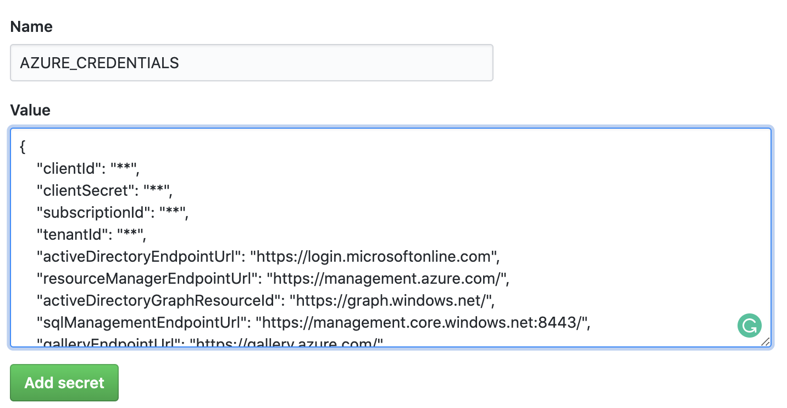

# GitHub Action for Azure Resource Manager (ARM) deployment
This example shows how you can use GitHub Actions to deploy an ARM template to Azure.

## What is an GitHub Action?
**GitHub describes this best itself:**   
GitHub Actions help you automate your software development workflows in the same place you store code and collaborate on pull requests and issues. You can write individual tasks, called actions, and combine them to create a custom workflow. Workflows are custom automated processes that you can set up in your repository to build, test, package, release, or deploy any code project on GitHub.

With GitHub Actions you can build end-to-end continuous integration (CI) and continuous deployment (CD) capabilities directly in your repository.

Source: https://help.github.com/en/actions/getting-started-with-github-actions/about-github-actions#about-github-actions

## What is the whiteducksoftware/azure-arm-action Action?
Lorem ipsum dolor sit amet, consectetur adipiscing elit. Donec lorem urna, scelerisque at ultrices vel, semper vel mi. Aenean sagittis sagittis lectus, vitae commodo velit pharetra id. Maecenas sit amet viverra enim. Curabitur fermentum mi mollis augue hendrerit, vel efficitur dolor finibus. Maecenas ornare nunc sed lacus consequat, quis luctus elit tristique. Sed convallis sapien eget ex aliquet volutpat. Phasellus ante elit, accumsan eget lorem sit amet, tristique iaculis dui. Maecenas dignissim turpis velit, et eleifend purus dignissim ut.

## How to use this Action?
Lorem ipsum dolor sit amet, consectetur adipiscing elit. Donec lorem urna, scelerisque at ultrices vel, semper vel mi. Aenean sagittis sagittis lectus, vitae commodo velit pharetra id. Maecenas sit amet viverra enim. Curabitur fermentum mi mollis augue hendrerit, vel efficitur dolor finibus. Maecenas ornare nunc sed lacus consequat, quis luctus elit tristique. Sed convallis sapien eget ex aliquet volutpat. Phasellus ante elit, accumsan eget lorem sit amet, tristique iaculis dui. Maecenas dignissim turpis velit, et eleifend purus dignissim ut.

### Required Inputs
* `creds` **Required**   
    [Create Service Principal for Authentication](#Create-Service-Principal-for-Authentication)    

* `resourceGroupName` **Required**   
    Provide the name of a resource group.

* `templateLocation` **Required**  
    Specify the path to the Azure Resource Manager template.  
(See [assets/json/template.json](assets/json/template.json))

* `deploymentMode`   
    Incremental (only add resources to resource group) or Complete (remove extra resources from resource group). Default: `Incremental`.
  
* `deploymentName`  
    Specifies the name of the resource group deployment to create.

* `parametersLocation`   
    Specify the path to the Azure Resource Manager parameters file.  
    (See [assets/json/serviceprincipal.json](assets/json/parameters.json))

#### Create service principal for Authentication
In order the action can authenticate to Azure you need to create a new or use an existing service principal. You can easily create an serviceprincipal using the [azure cli](https://docs.microsoft.com/en-us/cli/azure/?view=azure-cli-latest).   
Just run `az ad sp create-for-rbac -o json` and save the output of the command, navigate then to `Settings -> Secrets` and add the json output as value, as shown below.   
   
[assets/json/serviceprincipal.json](assets/json/serviceprincipal.json)   

If you are using an existing service principal just write the json yourself.

### Usage
Lorem ipsum dolor sit amet, consectetur adipiscing elit. Donec lorem urna, scelerisque at ultrices vel, semper vel mi. Aenean sagittis sagittis lectus, vitae commodo velit pharetra id. Maecenas sit amet viverra enim. Curabitur fermentum mi mollis augue hendrerit, vel efficitur dolor finibus. Maecenas ornare nunc sed lacus consequat, quis luctus elit tristique. Sed convallis sapien eget ex aliquet volutpat. Phasellus ante elit, accumsan eget lorem sit amet, tristique iaculis dui. Maecenas dignissim turpis velit, et eleifend purus dignissim ut.   

```yaml
- uses: whiteducksoftware/azure-arm-action@v1
  with:
    creds: ${{ secrets.AZURE_CREDENTIALS }}
    resourceGroupName: <YourResourceGroup>
    templateLocation: <path/to/azuredeploy.json>
```
File: [assets/yaml/usage.yaml](assets/yaml/usage.yaml)

### Example Workflow
Lorem ipsum dolor sit amet, consectetur adipiscing elit. Donec lorem urna, scelerisque at ultrices vel, semper vel mi. Aenean sagittis sagittis lectus, vitae commodo velit pharetra id. Maecenas sit amet viverra enim. Curabitur fermentum mi mollis augue hendrerit, vel efficitur dolor finibus. Maecenas ornare nunc sed lacus consequat, quis luctus elit tristique. Sed convallis sapien eget ex aliquet volutpat. Phasellus ante elit, accumsan eget lorem sit amet, tristique iaculis dui. Maecenas dignissim turpis velit, et eleifend purus dignissim ut.  

```yaml
on: [push]
name: AzureLoginSample

jobs:
  build-and-deploy:
    runs-on: ubuntu-latest
    steps:
    - uses: actions/checkout@master
    - uses: whiteducksoftware/azure-arm-action@v1
      with:
        creds: ${{ secrets.AZURE_CREDENTIALS }}
        resourceGroupName: github-action-arm-rg
        templateLocation: ./github-action-deploy-arm-template/template.json
        parameters: ./github-action-deploy-arm-template/parameters.json
```
File: [assets/yaml/example.yaml](assets/yaml/example.yaml)

## Where is the source code of this Action?
The source of this action can be found in our whiteducksoftware github organization.   
Here: https://github.com/whiteducksoftware/azure-arm-action